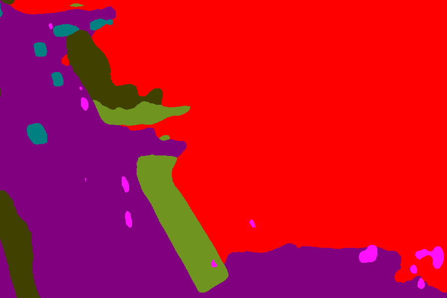
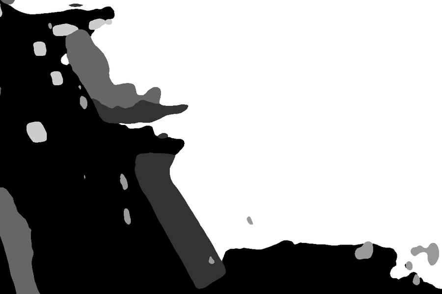
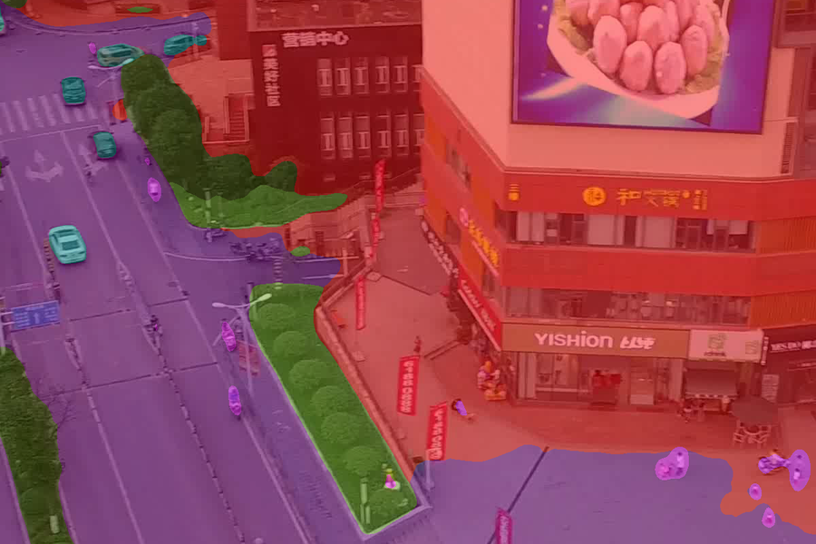

# Adaptive hybrid inference

Segments a whole video by inferring a keyframe with a trained segmentation
model, propagating that label forward with optical flow, and re-inferring
once cumulative forward-backward-consistency ("how much of the frame is
still trustworthy") drops to a configured threshold. Flow is cheap, the
model is accurate -- this uses the model only where propagation confidence
says it actually needs to.

## Usage

```bash
python -m adaptive_inference.run --video path/to/seq16/images.mp4 \
    --gt-dir path/to/seq16/Labels --threshold 0.95
```

Or from code:

```python
from adaptive_inference.config import load_config
from adaptive_inference.models import build_segmentation_model, build_flow_model
from adaptive_inference.pipeline import decode_video, run_adaptive_pipeline

cfg = load_config(overrides={"adaptive": {"valid_threshold": 0.90}})
frames = decode_video("seq16/images.mp4")
seg_model = build_segmentation_model(cfg)
flow_model = build_flow_model(cfg)
for result in run_adaptive_pipeline(frames, seg_model, flow_model, cfg):
    print(result.frame_index, result.source, result.valid_pct)
```

All paths in `config.yaml` are relative to the repo root regardless of cwd.
Override any field with a second YAML (`--config`) or the `--threshold` /
`--backbone` / `--flow-backend` CLI flags.

## The threshold is a quality dial, not really a speed dial

Flow has to be computed between every consecutive frame pair regardless of
how often the model gets called, so it's the fixed dominant cost. The model
call count barely moves total time -- what it moves is accuracy. Measured on
a 901-frame / 45s UAVid clip (ConvNeXt-Large + SEA-RAFT):

| threshold | model calls | total time | vs. every-frame inference | avg mIoU (10 GT checkpoints) |
|---|---|---|---|---|
| 0.75 | 5   | 180s | 2.16x faster | 0.51 (drifts to 0.39 by the end) |
| 0.90 | 23  | 189s | 2.05x faster | 0.62 |
| 0.95 | 71  | 206s | 1.89x faster | 0.71 (vs. 0.76 for the model alone) |
| 1.00 (model every frame) | 901 | 389s | 1.00x | 0.76 |

**Why cumulative valid_pct can plateau instead of keep decaying**: per-step
FB-consistency is typically 98-99% even during fast camera motion, but
whether that compounds toward the threshold depends on whether the same
~1-2% of pixels fail every step (occlusion edges, fast-moving objects -- the
cumulative AND flattens out once those are excluded) or a fresh random
subset fails each time (compounds down forever). In testing this plateaued
around 78-80% for hundreds of frames after the motion calmed down, which is
why raising the threshold from 75% to 95% cost many more model calls but
barely any more wall-clock time.

**Why FB-consistency isn't the same as label accuracy**: it only checks that
forward and backward flow geometrically agree -- it can't see the small
nearest-neighbor warping error introduced at every single chained step,
which keeps compounding at object boundaries even while the underlying flow
stays "valid." That's most of the gap between 0.95's 0.71 and the model's
own 0.76.

## GPU memory pitfalls this pipeline works around

- **Don't hold every frame's flow field at once.** A single 4K flow field is
  `2 x 2160 x 3840 x 4` bytes; 1800 of them (900 frames, both directions) is
  ~120GB. `run_adaptive_pipeline` computes and consumes flow in
  `flow.steps_per_chunk`-sized windows instead.
- **SEA-RAFT's correlation volume is the real cost, not resolution you'd
  guess from the config name.** `spring-L.json` already sets `scale: -1`
  (half-resolution internally) -- this config additionally uses `scale: -2`
  (quarter resolution), which cut flow time >3x for <0.01 mIoU cost in
  testing, and importantly avoids a hard cuDNN `grid_sample` ceiling
  (`RuntimeError: NVML_SUCCESS == r INTERNAL ASSERT FAILED`) that appears at
  batch sizes as low as 8 pairs when running at full resolution.
- **A second large resident model changes what batch size is safe.** With
  the segmentation model also resident on the GPU, the same batch size that
  worked with only the flow model loaded can crash. `steps_per_chunk: 16`
  (32 pairs/launch) was the value actually validated end-to-end with both
  models loaded; raise it with headroom margin, not up to the flow-only
  ceiling.

## Storage size if you save every frame's mask

Measured on real 3840x2160 UAVid output (`hiera_small` prediction, 6
classes):

| format | size / frame | 901-frame video | all 42 UAVid sequences (~38k frames) |
|---|---|---|---|
| `palette_png` (default, indexed color) | ~65 KB | ~59 MB | ~2.5 GB |
| `grayscale_png` (1 channel, class id) | ~68 KB | ~61 MB | ~2.6 GB |
| `rgb_png` (3-channel color visualization) | ~112 KB | ~101 MB | ~4.3 GB |
| `npy` (raw uint8 array, uncompressed) | 8.1 MB | ~7.3 GB | ~310 GB |
| *(for reference: a photo-realistic overlay PNG)* | ~9.3 MB | ~8.4 GB | ~355 GB |

Masks compress extremely well since there are only 6-7 distinct values in
the whole image -- `palette_png` is the right default. Overlay/photo-style
outputs are ~140x bigger since they inherit the source frame's full
photographic entropy; only generate those for the specific frames you want
to look at, not for a full video.

Same crop of one frame in each format (`docs/`):

| `palette_png` / `rgb_png` (render identically) | `grayscale_png`, raw | `grayscale_png`, stretched for viewing |
|---|---|---|
|  |  |  |

`grayscale_png` stores the same class ids (0-5) as `palette_png`, just
without a palette attached -- pixel values that close to 0 are effectively
invisible in a normal viewer until stretched to fill 0-255 (the file on disk
is unchanged either way; the stretched copy above is for display only).

For reference, the same region as a photo-realistic overlay (why those are
~140x bigger than a mask -- full photographic detail, not 6 flat colors):


